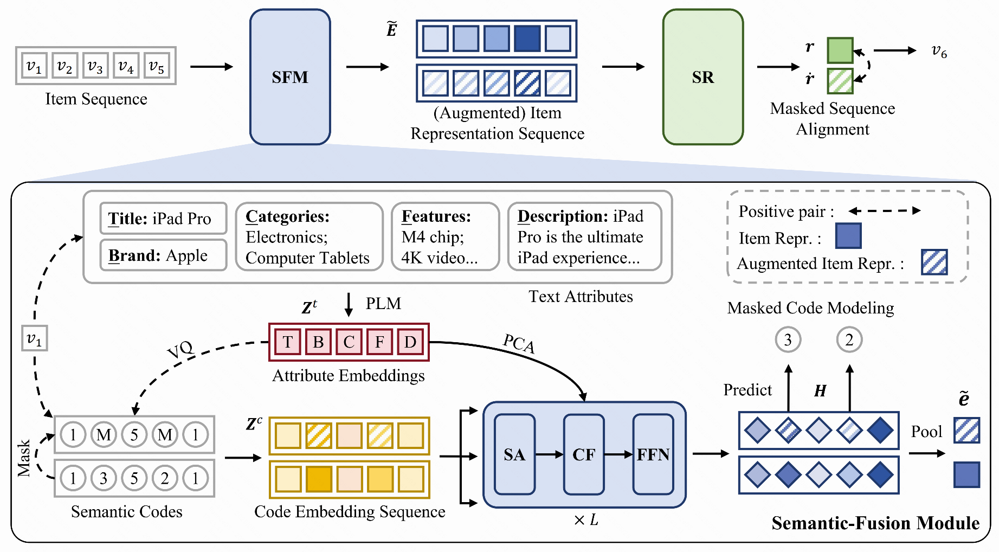

# CCFRec

This is the official PyTorch implementation for the paper:

> [Bridging Textual-Collaborative Gap through Semantic Codes for Sequential Recommendation](https://arxiv.org/abs/2503.12183)



## Overview

We propose **CCFRec**,  a novel **C**ode-based textual and **C**ollaborative semantic **F**usion method for sequential **Rec**ommendation. The key idea behind our approach is to bridge the gap between textual and collaborative information using semantic codes. Specifically, we generate fine-grained semantic codes from multi-view text embeddings through vector quantization techniques. Subsequently, we develop a code-guided semantic-fusion module based on the cross-attention mechanism to flexibly extract and integrate relevant information from text representations. In order to further enhance the fusion of textual and collaborative semantics, we introduce an optimization strategy that employs code masking with two specific objectives: masked code modeling and masked sequence alignment. The merit of these objectives lies in leveraging mask prediction tasks and augmented item representations to capture code correlations within individual items and enhance the sequence modeling of the recommendation backbone.

## Dependency
Please install required packages via `pip install -r requirements.txt`

## Quick Start

### Data Download and Preprocess

Download the following files into `./dataset/{dataset}`:

- Musical_Instruments:
[train](https://mcauleylab.ucsd.edu/public_datasets/data/amazon_2023/benchmark/5core/last_out_w_his/Musical_Instruments.train.csv.gz),
[valid](https://mcauleylab.ucsd.edu/public_datasets/data/amazon_2023/benchmark/5core/last_out_w_his/Musical_Instruments.valid.csv.gz),
[test](https://mcauleylab.ucsd.edu/public_datasets/data/amazon_2023/benchmark/5core/last_out_w_his/Musical_Instruments.test.csv.gz),
[meta](https://mcauleylab.ucsd.edu/public_datasets/data/amazon_2023/raw/meta_categories/meta_Musical_Instruments.jsonl.gz)

- Video_Games:
[train](https://mcauleylab.ucsd.edu/public_datasets/data/amazon_2023/benchmark/5core/last_out_w_his/Video_Games.train.csv.gz),
[valid](https://mcauleylab.ucsd.edu/public_datasets/data/amazon_2023/benchmark/5core/last_out_w_his/Video_Games.valid.csv.gz),
[test](https://mcauleylab.ucsd.edu/public_datasets/data/amazon_2023/benchmark/5core/last_out_w_his/Video_Games.test.csv.gz),
[meta](https://mcauleylab.ucsd.edu/public_datasets/data/amazon_2023/raw/meta_categories/meta_Video_Games.jsonl.gz)

- Industrial_and_Scientific:
[train](https://mcauleylab.ucsd.edu/public_datasets/data/amazon_2023/benchmark/5core/last_out_w_his/Industrial_and_Scientific.train.csv.gz),
[valid](https://mcauleylab.ucsd.edu/public_datasets/data/amazon_2023/benchmark/5core/last_out_w_his/Industrial_and_Scientific.valid.csv.gz),
[test](https://mcauleylab.ucsd.edu/public_datasets/data/amazon_2023/benchmark/5core/last_out_w_his/Industrial_and_Scientific.test.csv.gz),
[meta](https://mcauleylab.ucsd.edu/public_datasets/data/amazon_2023/raw/meta_categories/meta_Industrial_and_Scientific.jsonl.gz)

- Baby_Products:
[train](https://mcauleylab.ucsd.edu/public_datasets/data/amazon_2023/benchmark/5core/last_out_w_his/Baby_Products.train.csv.gz),
[valid](https://mcauleylab.ucsd.edu/public_datasets/data/amazon_2023/benchmark/5core/last_out_w_his/Baby_Products.valid.csv.gz),
[test](https://mcauleylab.ucsd.edu/public_datasets/data/amazon_2023/benchmark/5core/last_out_w_his/Baby_Products.test.csv.gz),
[meta](https://mcauleylab.ucsd.edu/public_datasets/data/amazon_2023/raw/meta_categories/meta_Baby_Products.jsonl.gz)

Run the command:
```
bash run_preprocess.sh
```

### Generate semantic codes

```
cd vq
python generate_faiss_multi_emb.py --config Musical_Instruments.yaml
```

### Train the model

```
bash run.sh
```

### Best configurations for each dataset

```
python main.py \
    --dataset=Musical_Instruments \
    --lr=0.001 \
    --neg_num=24000 \
    --text_types title brand features categories description \
    --mask_ratio=0.5 \
    --cl_weight=0.4 \
    --mlm_weight=0.6 \
    --data_path=./dataset \
    --text_index_path=.code.pq.20_256.pca128.title_brand_features_categories_description.json \
    --code_level=20 \
    --n_codes_per_lel=256 \
    --max_his_len=20 \
    --batch_size=100 \
    --dropout_prob=0.3 \
    --dropout_prob_cross=0.3 \
    --n_layers=2 \
    --n_heads=4 \
    --embedding_size=128 \
    --hidden_size=512\
    --early_stop=100\
    --log_dir="./logs/傅立叶"\
    --device=cuda:1

python main.py \
    --dataset=Video_Games \
    --lr=0.001 \
    --neg_num=25000 \
    --text_types title brand features categories description \
    --mask_ratio=0.5 \
    --cl_weight=0.5 \
    --mlm_weight=0.3 \
    --data_path=./dataset \
    --text_index_path=.code.pq.20_256.pca128.title_brand_features_categories_description.json \
    --code_level=20 \
    --n_codes_per_lel=256 \
    --max_his_len=20 \
    --batch_size=400 \
    --dropout_prob=0.2 \
    --dropout_prob_cross=0.1 \
    --n_layers=2 \
    --n_heads=2 \
    --embedding_size=128 \
    --hidden_size=512

python main.py \
    --dataset=Industrial_and_Scientific \
    --lr=0.0005 \
    --neg_num=25000 \
    --text_types title brand features categories description \
    --mask_ratio=0.5 \
    --cl_weight=0.4 \
    --mlm_weight=0.2 \
    --data_path=./dataset \
    --text_index_path=.code.pq.20_256.pca128.title_brand_features_categories_description.json \
    --code_level=20 \
    --n_codes_per_lel=256 \
    --max_his_len=20 \
    --batch_size=400 \
    --dropout_prob=0.4 \
    --dropout_prob_cross=0.1 \
    --n_layers=2 \
    --n_heads=2 \
    --embedding_size=128 \
    --hidden_size=512

python main.py \
    --dataset=Baby_Products \
    --lr=0.0005 \
    --neg_num=25000 \
    --text_types title brand features categories description \
    --mask_ratio=0.5 \
    --cl_weight=0.5 \
    --mlm_weight=0.3 \
    --data_path=./dataset \
    --text_index_path=.code.pq.20_256.pca128.title_brand_features_categories_description.json \
    --code_level=20 \
    --n_codes_per_lel=256 \
    --max_his_len=20 \
    --batch_size=400 \
    --dropout_prob=0.2 \
    --dropout_prob_cross=0.2 \
    --n_layers=2 \
    --n_heads=2 \
    --embedding_size=128 \
    --hidden_size=512
```


## Citation

If you find our research valuable, please consider citing it as follows:
```
@inproceedings{ccfrec,
author = {Liu, Enze and Zheng, Bowen and Zhao, Wayne Xin and Wen, Ji-Rong},
title = {Bridging Textual-Collaborative Gap through Semantic Codes for Sequential Recommendation},
year = {2025},
publisher = {Association for Computing Machinery},
booktitle = {Proceedings of the 31st ACM SIGKDD Conference on Knowledge Discovery and Data Mining V.2},
pages = {1788–1798},
location = {Toronto ON, Canada},
series = {KDD '25}
}
```
